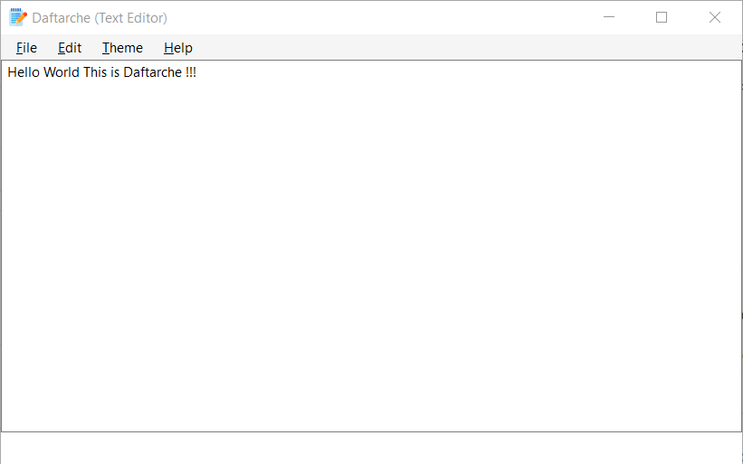

    

<h1 style="text-align: right;direction: rtl;" dir="rtl">📝دفترچه (ادیتور ایرانی متن باز برای ویندوز)📝</h1>

 هدف از این پروژه  این هست که ساخت یک ادیتور متنی با قابلیت های مختلف برای ویندوز می باشد ! (با زبان سی شارپ)

<h3 style="text-align: right;direction: rtl;" dir="rtl">🌟 قابلیت که در آینده اضافه خواهد شد : </h3>
<ul dir="rtl">
    <li dir="rtl" style="text-align: right;direction: rtl;">تاریخ شمسی در برنامه</li>
    <li dir="rtl" style="text-align: right;direction: rtl;">تم ها و قابلیت شخصی سازی برنامه</li>
    <li dir="rtl" style="text-align: right;direction: rtl;">قابلیت اضافه شدن حافظه موقت برای فایل هایی که از قبل ادیت شده</li>
    <li dir="rtl" style="text-align: right;direction: rtl;">اضافه شدن قابلیت دارک مود</li>
</ul>
<h3 dir="rtl" style="text-align: right;direction: rtl;">🤝 مشارکت</h3>

این پروژه به صورت اوپن سورس منتشر می شود از این‌جهت ، هرکسی می‌تواند در صورت نیاز اقدام به مشارکت برای اصلاح یا بهبود یا حتی اضافه کردن ویژگی های جدید به این پروژه کند، همچنین ایجاد فورک های مختلف از پروژه و توسعه پروژه در شاخه‌ای جدا، چه به‌صورت رایگان و چه به‌صورت تجاری،هیچگونه مانعی ندارد

